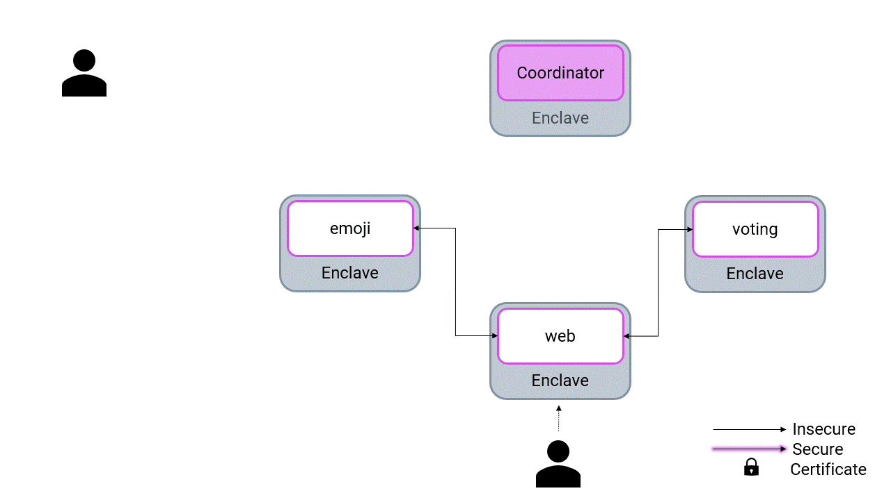

# Confidential Emoji.voto

A microservice application that allows users to vote for their favorite emoji,
and tracks votes received on a leaderboard. May the best emoji win.
The application is a fork of [Linkerd's emojivoto](https://github.com/BuoyantIO/emojivoto) refactored as a confidential computing application.

The application is composed of the following 3 services:

* [emojivoto-web](emojivoto-web/): Web frontend and REST API
* [emojivoto-emoji-svc](emojivoto-emoji-svc/): gRPC API for finding and listing emoji
* [emojivoto-voting-svc](emojivoto-voting-svc/): gRPC API for voting and leaderboard

Confidential emojivoto is build as a confidential computing application:

* Each service runs in a confidential enclave using [EGo](https://ego.dev)
* The application is distributed, configured, and connected using [MarbleRun](https://github.com/edgelesssys/marblerun)



## Running

### In Minikube

1. Start Minikube

    Start with a fresh minikube and give it sufficient memory.

    * If you're running minikube on a machine that support SGX1+FLC (e.g.Azure Standard_DC*s)

        ```bash
        minikube delete
        minikube start --mount --mount-string /dev/sgx:/dev/sgx --memory 6g
        ```

        Note that your system either requires Linux 5.11+ with SGX support enabled (`CONFIG_X86_SGX=y`), or [Intel's SGX DCAP Driver](https://www.intel.com/content/www/us/en/developer/articles/guide/intel-software-guard-extensions-data-center-attestation-primitives-quick-install-guide.html) is installed with version 1.41.

        Install the Intel SGX device plugin:

        ```bash
        kubectl apply -f https://github.com/jetstack/cert-manager/releases/download/v1.10.1/cert-manager.yaml
        kubectl wait --for=condition=available --timeout=60s -n cert-manager --all deployments
        kubectl apply -k https://github.com/intel/intel-device-plugins-for-kubernetes/deployments/sgx_plugin/overlays/epc-nfd/?ref=v0.23.0
        ```

    * Otherwise, if you want to test it out on an unsupported machine in simulation mode

        ```bash
        minikube delete
        minikube start --memory=6g
        ```

1. Install MarbleRun

    Deploy with [MarbleRun CLI](https://www.marblerun.sh/docs/getting-started/quickstart/#step-1-install-the-cli)

    * If you're running minikube on an Azure VM that supports SGX1+FLC (e.g.Azure Standard_DC*s)

        ```bash
        marblerun install
        ```

    * If you're running minikube on a generic SGX capable machine that supports SGX1+FLC

        Assuming you have a PCCS reachable at `https://localhost:8081/sgx/certification/v3/`, install MarbleRun using the following command:

        ```bash
        marblerun install --dcap-qpl=intel --dcap-pccs-url="https://host.minikube.internal:8081/sgx/certification/v3/" --dcap-secure-cert="FALSE"
        ```

        See [our docs](https://docs.edgeless.systems/marblerun/deployment/kubernetes#dcap-configuration) for more information on how to configure MarbleRun for generic SGX environments.

    * Otherwise

        ```bash
        marblerun install --simulation
        ```

    Wait for the control plane to finish installing:

    ```bash
    marblerun check
    ```

1. Port forward the Coordinator’s Client API

    ```bash
    kubectl -n marblerun port-forward svc/coordinator-client-api 4433:4433 --address localhost >/dev/null &
    export MARBLERUN=localhost:4433
    ```

1. Verify the Quote and get the Coordinator's Root-Certificate
    * If you're running minikube on a machine that support SGX1+FLC

        ```bash
        marblerun certificate root $MARBLERUN -o marblerun.crt
        ```

    * Otherwise

        ```bash
        marblerun certificate root $MARBLERUN -o marblerun.crt --insecure
        ```

1. (Optional) Create a user key and certificate

    To verify that your deployment has not been altered, the Manifest is usually set in stone after it was set to ensure no one can alter with your cluster.

    Yet, updates play an important role to ensure your software stays secure. To avoid having to redeploy your application from scratch, MarbleRun allows uploading a separate [“Update Manifest”](https://www.marblerun.sh/docs/workflows/update-manifest/) which increases the minimum SecurityVersion of one or multiple already deployed packages.

    In order to deploy an "Update Manifest",  you need to be in possession of a certificate/private key pair of a user with update permissions for the packages you wish to update.
    This information is defined in the `Users` section of the original Manifest.

    First we create the new `updateVoting` role in the manifest. Users with this role will be able to update the package `voting-svc`.

    ```javascript
    {
        //...
        "Users": {
            //...
        },
        "Roles": {
            "updateVoting": {
                "ResourceType": "Packages",
                "ResourceNames": ["voting-svc"],
                "Actions": ["UpdateSecurityVersion"]
            }
        }
        //...
    }
    ```

    Next we generate a certificate and key:

    ```bash
    openssl req -x509 -newkey rsa:4096 -sha256 -days 3650 -nodes -keyout admin_private.key -out admin_certificate.crt
    ```

    Use the following command to preserve newlines correctly:

    ```bash
    awk 'NF {sub(/\r/, ""); printf "%s\\n",$0;}' admin_certificate.crt
    ```

    Create a new user called `emojivoto-admin` in the `Users` section in `tools/manifest.json`.
    Set the output of the previous command as the value for `Certificate`, and create a role binding for `updateVoting`:

    ```javascript
    {
        //...
        "Users": {
            "emojivoto-admin": {
                "Certificate": "-----BEGIN CERTIFICATE-----\nMIIFazCCA1...hIl3LfuHs=\n-----END CERTIFICATE-----\n",
                "Roles": [
                    "updateVoting"
                ]
            }
        }
        //...
    }
    ```

1. (Optional) Create a recovery key

    As described in the [MarbleRun docs](https://www.marblerun.sh/docs/features/recovery/) some cases require manual intervention to restart the Coordinator on a different host.

    For this we need a recovery key which we set in the manifest.

    Generate the key:

    ```bash
    openssl genrsa -out recovery_priv.key 4096
    openssl rsa -in recovery_priv.key -outform PEM -pubout -out recovery_pub.key
    ```

    Use the following command to preserve newlines correctly:

    ```bash
    awk 'NF {sub(/\r/, ""); printf "%s\\n",$0;}' recovery_pub.key
    ```

    Set the output of the previous command in `tools/manifest.json` as the value for `recoveryKey1` in the `RecoveryKeys` section:

    ```javascript
    //...
    "RecoveryKeys": {
        "recoveryKey1": "-----BEGIN PUBLIC KEY-----\nMIICIjANBg...8CAwEAAQ==\n-----END PUBLIC KEY-----\n"
    }
    //...
    ```

1. Set the manifest

    The emojivoto application comes with a webinterface reachable through HTTPS.
    In order to provision a certificate with the correct domain we need to configure the right domain.

    * If your running minikube on your local machine you can leave the default value `localhost`

    * If you're running minikube on a remote machine you can set the domain name of your remote machine:

    ```bash
    cat "tools/manifest.json" | sed "s/localhost/<your-domain>/g" > tools/manifest.json
    ```

    Finally, we can upload the manifest to the control plane:

    * If you're running minikube on a machine that support SGX1+FLC

        ```bash
        marblerun manifest set tools/manifest.json $MARBLERUN --recoverydata recovery.json
        ```

    * Otherwise

        ```bash
        marblerun manifest set tools/manifest.json $MARBLERUN --insecure --recoverydata recovery.json
        ```

1. Deploy emojivoto using [helm](https://helm.sh/docs/intro/install/)

    * If you're running minikube on an Azure VM that supports SGX1+FLC

        ```bash
        helm install -f ./kubernetes/sgx_values.yaml emojivoto ./kubernetes --create-namespace -n emojivoto
        ```

    * If you're running minikube on a SGX capable machine that supports SGX1+FLC

        Assuming you have a PCCS reachable at `https://localhost:8081/sgx/certification/v3/`, install emojivoto using the following command:

        ```bash
        helm install -f ./kubernetes/sgx_values.yaml emojivoto ./kubernetes --create-namespace -n emojivoto \
            --set dcap.qpl=intel \
            --set dcap.pccsUrl="https://host.minikube.internal:8081/sgx/certification/v3/" \
            --set dcap.useSecureCert="FALSE"
        ```

        The values for `dcap.qpl` and `dcap.useSecureCert` should be the same as the values for the flags `--dcap-pccs-url` and `--dcap-secure-cert` used when installing MarbleRun.

    * Otherwise

        ```bash
        helm install -f ./kubernetes/nosgx_values.yaml emojivoto ./kubernetes --create-namespace -n emojivoto
        ```

    You can check with `kubectl get pods -n emojivoto` that all pods are running.

1. Verify the manifest
    You can verify the manifest on the client-side before using the app:

    * If you're running minikube on a machine that support SGX1+FLC

        ```bash
        marblerun manifest verify tools/manifest.json $MARBLERUN
        ```

    * Otherwise

        ```bash
        marblerun manifest verify tools/manifest.json $MARBLERUN --insecure
        ```

1. Use the app!

    ```bash
    sudo kubectl -n emojivoto port-forward svc/web-svc 443:443 --address 0.0.0.0
    ```

    * Browse to [https://localhost](https://localhost).
    * If your running on a custom domain browse to `https://\<your-domain\>`

    You’ll be presented with a certificate warning because your browser does not know MarbleRun’s root certificate as a root of trust. You can safely ignore this error for now and proceed to the website.
    Voila! Your emoji votes have never been safer!

1. (Optional) Update emojivoto

    We would like to demonstrate an update procedure with MarbleRun.

    If you have voted for the Doughnut emoji you have been presented with an error message. This is an intentional "bug" in the application that we are going to fix now by rolling out a patched emojivoto version.

    In a non-confidential environment, you could simply replace the currently running version with the patched one. In our case, the Coordinator prevents unauthorized alterations to the deployment and only accepts versions as previously specified in the manifest.

    To avoid having to redeploy your entire application from scratch, MarbleRun allows its users to upload a separate "Update Manifest" which defines new versions of a previously set `Package`.

    To upload the "Update Manifest" we need to authenticate ourselves to the Coordinator using the previously created admin key and certificate:

    ```bash
    marblerun manifest update tools/update-manifest.json $MARBLERUN --cert admin_certificate.crt --key admin_private.key [--insecure]
    ```

    We can now update the image used by the emojivoto voting Statefulset:

    ```bash
    kubectl set image -n emojivoto statefulset/voting voting-svc=ghcr.io/edgelesssys/emojivoto/voting-svc:v0.5.0-fix
    ```

    Updating the manifest will invalidate MarbleRun's certificate chain so that the existing services will not accept old versions of the updated voting service anymore. Hence, we need to restart the other services to obtain a fresh certificate chain:

    ```bash
    kubectl rollout restart -n emojivoto statefulset emoji web
    ```

    Wait for the pods to restart. Once they are up and running again you can reconnect to the webpage and vote for the Doughnut as your favorite emoji!

1. (Optional) Perform a Coordinator recovery

    1. Bring the Coordinator into recovery mode

        As already mentioned, some cases require manual intervention to recover the Coordinator, for example, if the host, the Coordinator was running on, changes.

        On minikube we can simulate this behavior by first stopping minikube, and then deleting the `sealed_key` of the Coordinator.

        * If you are running minikube in docker, `sealed_key` can be removed as follows:

        ```bash
        minikube stop
        rm /var/lib/docker/volumes/minikube/_data/hostpath-provisioner/marblerun/coordinator-pv-claim/sealed_key
        ```

        * Restart minikube

        ```bash
        minikube start
        ```

        * Note that the previously running emojivoto pods will now fail to start. Check the status of the coordinator:

        ```bash
        marblerun status $MARBLERUN [--insecure]
        ```

        * The output should be the following:

        ```bash
        1: Coordinator is in recovery mode. Either upload a key to unseal the saved state, or set a new manifest. For more information on how to proceed, consult the documentation.
        ```

    1. Decrypt the Recovery Key

        Luckily we provided a recovery key when we first set the manifest. We can now decrypt the recovery secret we received from the coordinator:

        ```bash
        cat recovery.json | jq -r '.RecoverySecrets.recoveryKey1' | base64 -d > recovery_key_encrypted
        openssl pkeyutl -inkey recovery_priv.key -in recovery_key_encrypted -pkeyopt rsa_padding_mode:oaep -pkeyopt rsa_oaep_md:sha256 -decrypt -out recovery_key_decrypted
        ```

    1. Recover the Coordinator

        Now we can upload the key and recover MarbleRun without losing data:

        ```bash
        marblerun recover recovery_key_decrypted $MARBLERUN [--insecure]
        ```

        If the recovery was successful all emojivoto pods can once again start correctly.

1. (Optional) Scaling your application

    Increasing or decreasing the number of pods running in your application requires no extra steps with MarbleRun.

    * If you want to scale the web frontend to use 3 pods:

    ```bash
    kubectl scale statefulset -n emojivoto web --replicas=3
    ```

    * And scale it back down to only 1:

    ```bash
    kubectl scale statefulset -n emojivoto web --replicas=1

### In AKS

We have provided a [script](tools/aks_install.sh) to deploy emojivoto in an AKS cluster:

```bash
tools/aks_install.sh <azure resourceGroup> <azure clusterName>
# Example
tools/aks_install edgeless emojivoto
```

The script requires the [bash Azure CLI](https://docs.microsoft.com/en-us/cli/azure/install-azure-cli) to be installed.
Further you need to be [logged in](https://docs.microsoft.com/en-us/cli/azure/authenticate-azure-cli) to your Azure account.

The following tasks are performed by the script:

1. Optionally install linkerd
1. Install MarbleRun
1. Install an NGINX-Ingress-Controller
1. Associate domain names with LoadBalancer public IPs
    * marblerun-xxx.cluster-domain -> MarbleRun Client API
    * emojivoto-xxx.cluster-domain -> NGINX-Ingress-Controller
1. Create an emojivoto deployment
1. Create an ingress resource to forward traffic via HTTPS-SNI
    * `https://emojivoto-xxx.cluster-domain` -> emojivoto

Uninstall with:

```bash
tools/aks_uninstall.sh
```

### Generating some traffic

The `VoteBot` service can generate some traffic for you. It votes on emoji
"randomly" as follows:

* It votes for :doughnut: 15% of the time.
* When not voting for :doughnut:, it picks an emoji at random

If you're running the app using the instructions above, the VoteBot will have
been deployed and will start sending traffic to the vote endpoint.

If you'd like to run the bot manually:

```bash
export WEB_HOST=localhost:443 # replace with your web location
go run emojivoto-web/cmd/vote-bot/main.go
```

## Build

Build with [EGo](https://ego.dev):

```bash
tools/install-dependencies.sh
ego env make build
```

## Docker

Build docker images:

```bash
docker buildx build --secret id=signingkey,src=<path to private.pem> --target release_web --tag ghcr.io/edgelesssys/emojivoto/web:latest . --label org.opencontainers.image.source=https://github.com/edgelesssys/emojivoto.git
docker buildx build --secret id=signingkey,src=<path to private.pem> --target release_emoji_svc --tag ghcr.io/edgelesssys/emojivoto/emoji-svc:latest . --label org.opencontainers.image.source=https://github.com/edgelesssys/emojivoto.git
docker buildx build --secret id=signingkey,src=<path to private.pem> --target release_voting_svc --tag ghcr.io/edgelesssys/emojivoto/voting-svc:latest . --label org.opencontainers.image.source=https://github.com/edgelesssys/emojivoto.git
docker buildx build --secret id=signingkey,src=<path to private.pem> --target release_voting_update --tag ghcr.io/edgelesssys/emojivoto/voting-svc:latest-fix . --label org.opencontainers.image.source=https://github.com/edgelesssys/emojivoto.git
```

## License

Copyright 2020 Buoyant, Inc. All rights reserved.\
Copyright 2020 Edgeless Systems GmbH. All rights reserved.

Licensed under the Apache License, Version 2.0 (the "License"); you may not use
these files except in compliance with the License. You may obtain a copy of the
License at

    http://www.apache.org/licenses/LICENSE-2.0

Unless required by applicable law or agreed to in writing, software distributed
under the License is distributed on an "AS IS" BASIS, WITHOUT WARRANTIES OR
CONDITIONS OF ANY KIND, either express or implied. See the License for the
specific language governing permissions and limitations under the License.
